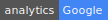

# Analytics
Analytics beacon for general purpose.

---


## Installation

You can deploy to Heroku:

[](https://heroku.com/deploy)

or run on your own machine:

```bash
git clone git@github.com:gokaygurcan/analytics.git
cd analytics
npm install
npm start
```


## Showcase

| Type        | Google (svg) | Google (png) | Yandex (svg) | Yandex (png) |
| ----------- | ------------ | ------------ | ------------ | ------------ |
| Flat square |  |  |  |  |
| Flat        |  |  |  |  |
| Plastic     |  |  |  |  |
| Social      |  |  |  |  |


## Usage

You can put the beacon in your Readme file to track GitHub statistics:

```markdown

```

Or, you can call the pixel via AJAX call or something similar to track some pages/events:

```javascript
$.ajax({
  method: 'GET',
  url: 'https://analytics.gokaygurcan.com/UA-XXXXXXXX-X/organization_name/repository_name.gif'
}).done(function(response) {
  console.log(response); // this will be a 1x1 pixel image though
});
```

> Note: you can use anything you like but using organization_name/repository_name will help you if you want to use more than one repository with only one tracking id.


## Examples

### Google

You can use either _svg_ or _png_ extension with _style_ querystring. Default is _flat-square_.

- Flat square: ``

- Flat: ``

- Plastic: ``

- Social: ``

### Yandex

You can use either _svg_ or _png_ extension with _style_ querystring. Default is _flat-square_.

- Flat square: ``

- Flat: ``

- Plastic: ``

- Social: ``

### Pixel

You can only use gif extension, no svg or png can be used as a pixel image.

- Pixel: ``


## License

MIT © [Gökay Gürcan](https://www.gokaygurcan.com/)
